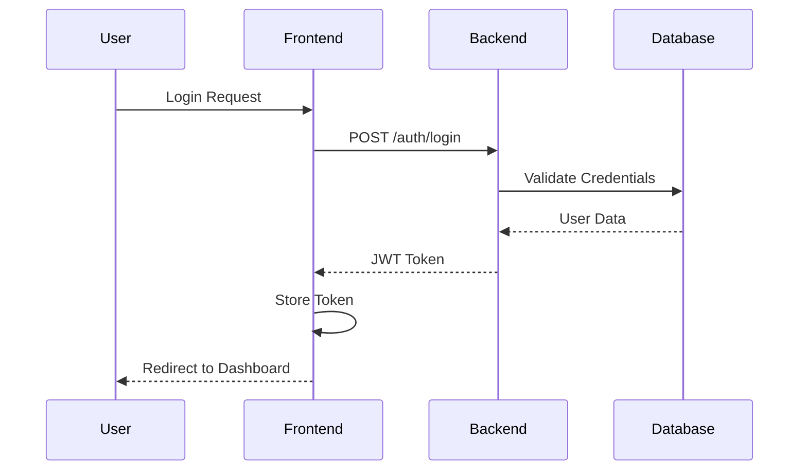
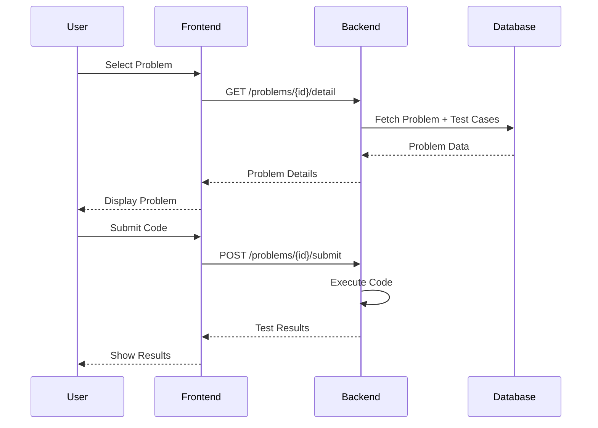
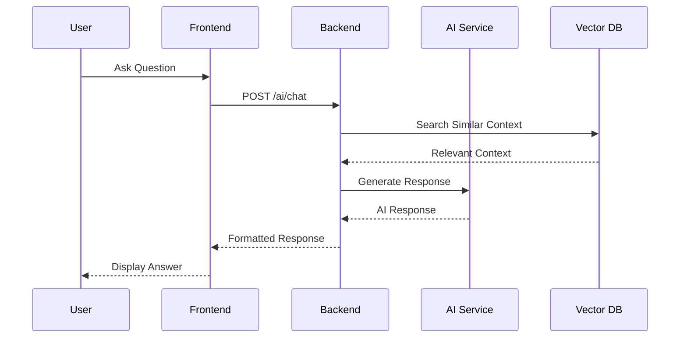

# System Architecture

This document provides a comprehensive overview of the Interview Prep Platform's system architecture, including data flow, component interactions, and infrastructure design.

## 🏛️ High-Level Architecture

```
┌─────────────────┐    ┌─────────────────┐    ┌─────────────────┐
│   Frontend      │    │    Backend      │    │   External      │
│   (Next.js)     │◄──►│   (FastAPI)     │◄──►│   Services      │
│                 │    │                 │    │                 │
│ • React UI      │    │ • REST API      │    │ • Groq AI       │
│ • TypeScript    │    │ • Authentication│    │ • PostgreSQL    │
│ • Tailwind CSS  │    │ • Business Logic│    │ • pgvector      │
│ • State Mgmt    │    │ • Data Access   │    │                 │
└─────────────────┘    └─────────────────┘    └─────────────────┘
```

## 🔄 Data Flow Architecture

### User Authentication Flow


### Problem Solving Flow


### AI Assistant Flow


## 🗄️ Database Architecture

### Entity Relationship Diagram
```
┌─────────────┐     ┌─────────────┐     ┌─────────────┐
│    Users    │     │  Problems   │     │ Test Cases  │
│─────────────│     │─────────────│     │─────────────│
│ id (PK)     │     │ id (PK)     │     │ id (PK)     │
│ email       │     │ title       │     │ problem_id  │
│ password    │     │ slug        │◄────│ input_data  │
│ created_at  │     │ difficulty  │     │ expected    │
│ updated_at  │     │ description │     │ is_hidden   │
└─────────────┘     │ source      │     │ order_index │
        │           │ created_at  │     └─────────────┘
        │           └─────────────┘
        │
        ▼
┌─────────────┐     ┌─────────────┐     ┌─────────────┐
│    Notes    │     │Note Shares  │     │Knowledge    │
│─────────────│     │─────────────│     │Base         │
│ id (PK)     │     │ note_id     │     │─────────────│
│ owner_id    │     │ user_id     │     │ id (PK)     │
│ title       │     │ permission  │     │ source_type │
│ content     │     │ created_at  │     │ source_id   │
│ created_at  │     └─────────────┘     │ content     │
│ updated_at  │                         │ embedding   │
└─────────────┘                         │ created_at  │
                                        └─────────────┘
```

### Database Schema Details

#### Core Tables
```sql
-- Users table
CREATE TABLE users (
    id UUID PRIMARY KEY DEFAULT gen_random_uuid(),
    email VARCHAR(255) UNIQUE NOT NULL,
    hashed_password VARCHAR(255) NOT NULL,
    created_at TIMESTAMP DEFAULT NOW(),
    updated_at TIMESTAMP DEFAULT NOW()
);

-- Problems table
CREATE TABLE problems (
    id UUID PRIMARY KEY DEFAULT gen_random_uuid(),
    title VARCHAR(255) NOT NULL,
    slug VARCHAR(255) UNIQUE NOT NULL,
    difficulty VARCHAR(20) NOT NULL CHECK (difficulty IN ('Easy', 'Medium', 'Hard')),
    description TEXT,
    source VARCHAR(100),
    created_at TIMESTAMP DEFAULT NOW(),
    updated_at TIMESTAMP DEFAULT NOW()
);

-- Test cases table
CREATE TABLE test_cases (
    id UUID PRIMARY KEY DEFAULT gen_random_uuid(),
    problem_id UUID NOT NULL REFERENCES problems(id) ON DELETE CASCADE,
    input_data TEXT NOT NULL,
    expected_output TEXT NOT NULL,
    is_hidden BOOLEAN DEFAULT FALSE,
    order_index INTEGER DEFAULT 0,
    created_at TIMESTAMP DEFAULT NOW()
);

-- Notes table
CREATE TABLE notes (
    id UUID PRIMARY KEY DEFAULT gen_random_uuid(),
    owner_id UUID NOT NULL REFERENCES users(id) ON DELETE CASCADE,
    title VARCHAR(255) NOT NULL,
    content TEXT,
    created_at TIMESTAMP DEFAULT NOW(),
    updated_at TIMESTAMP DEFAULT NOW()
);

-- Knowledge base for AI (with vector embeddings)
CREATE TABLE knowledge_base (
    id UUID PRIMARY KEY DEFAULT gen_random_uuid(),
    source_type VARCHAR(50) NOT NULL,
    source_id UUID,
    content TEXT NOT NULL,
    embedding vector(1536), -- OpenAI embedding dimension
    created_at TIMESTAMP DEFAULT NOW()
);
```

#### Indexes for Performance
```sql
-- Performance indexes
CREATE INDEX idx_problems_difficulty ON problems(difficulty);
CREATE INDEX idx_problems_slug ON problems(slug);
CREATE INDEX idx_test_cases_problem_id ON test_cases(problem_id);
CREATE INDEX idx_notes_owner_id ON notes(owner_id);
CREATE INDEX idx_knowledge_base_source ON knowledge_base(source_type, source_id);

-- Vector similarity index
CREATE INDEX ON knowledge_base USING ivfflat (embedding vector_cosine_ops);
```

## 🔐 Security Architecture

### Authentication & Authorization
```
┌─────────────┐    ┌─────────────┐    ┌─────────────┐
│   Client    │    │   Backend   │    │  Database   │
│             │    │             │    │             │
│ JWT Token   │───►│ Verify JWT  │───►│ User Data   │
│ (Bearer)    │    │ Extract User│    │ Permissions │
│             │    │ Check Perms │    │             │
└─────────────┘    └─────────────┘    └─────────────┘
```

### Security Layers
1. **Transport Security**: HTTPS/TLS encryption
2. **Authentication**: JWT tokens with expiration
3. **Authorization**: Role-based access control
4. **Input Validation**: Pydantic schemas
5. **SQL Injection Prevention**: SQLAlchemy ORM
6. **CORS Protection**: Configured for frontend domain
7. **Rate Limiting**: API endpoint throttling

### JWT Token Structure
```json
{
  "header": {
    "alg": "HS256",
    "typ": "JWT"
  },
  "payload": {
    "sub": "user@example.com",
    "exp": 1640995200,
    "iat": 1640908800
  },
  "signature": "..."
}
```

## 🧠 AI System Architecture

### RAG (Retrieval-Augmented Generation) Pipeline
```
┌─────────────┐    ┌─────────────┐    ┌─────────────┐
│   Query     │    │  Retrieval  │    │ Generation  │
│             │    │             │    │             │
│ User Input  │───►│ Vector      │───►│ LLM with    │
│ Processing  │    │ Search      │    │ Context     │
│             │    │ Context     │    │ Response    │
└─────────────┘    └─────────────┘    └─────────────┘
```

### AI Component Breakdown
```python
# AI System Components
class AISystem:
    def __init__(self):
        self.embedder = EmbeddingService()      # Text to vectors
        self.retriever = ContextRetriever()     # Vector similarity search
        self.generator = ResponseGenerator()     # LLM response generation
        self.indexer = KnowledgeIndexer()       # Content indexing
    
    def process_query(self, query: str, user_id: str):
        # 1. Generate query embedding
        query_embedding = self.embedder.embed(query)
        
        # 2. Retrieve relevant context
        context = self.retriever.search(query_embedding, user_id)
        
        # 3. Generate response with context
        response = self.generator.generate(query, context)
        
        return response
```

### Knowledge Base Structure
```
Knowledge Base
├── Problem Descriptions
│   ├── Algorithm explanations
│   ├── Solution approaches
│   └── Complexity analysis
├── User Notes
│   ├── Personal study notes
│   ├── Problem solutions
│   └── Learning insights
└── Educational Content
    ├── Data structures
    ├── Algorithm patterns
    └── Best practices
```

## 🔄 API Architecture

### RESTful API Design
```
Base URL: /api/v1/

Authentication:
├── POST /auth/signup          # User registration
├── POST /auth/login           # User login
└── POST /auth/refresh         # Token refresh

Problems:
├── GET  /problems/            # List problems
├── GET  /problems/{id}        # Get problem
├── GET  /problems/{id}/detail # Problem with test cases
└── POST /problems/{id}/submit # Submit solution

Notes:
├── GET    /notes/             # List user notes
├── POST   /notes/             # Create note
├── GET    /notes/{id}         # Get note
├── PUT    /notes/{id}         # Update note
├── DELETE /notes/{id}         # Delete note
└── POST   /notes/{id}/share   # Share note

AI:
└── POST /ai/chat              # AI assistant chat
```

### API Response Format
```json
{
  "success": true,
  "data": {
    "id": "uuid",
    "title": "Two Sum",
    "difficulty": "Easy",
    "description": "...",
    "test_cases": [...]
  },
  "message": "Success",
  "timestamp": "2024-01-01T00:00:00Z"
}
```

### Error Response Format
```json
{
  "success": false,
  "error": {
    "code": "VALIDATION_ERROR",
    "message": "Invalid input data",
    "details": {
      "field": "email",
      "issue": "Invalid email format"
    }
  },
  "timestamp": "2024-01-01T00:00:00Z"
}
```

## 🚀 Deployment Architecture

### Development Environment
```
┌─────────────┐    ┌─────────────┐    ┌─────────────┐
│ Frontend    │    │ Backend     │    │ Database    │
│ localhost   │    │ localhost   │    │ localhost   │
│ :3000       │◄──►│ :8000       │◄──►│ :5432       │
│             │    │             │    │             │
│ Next.js Dev │    │ FastAPI     │    │ PostgreSQL  │
│ Server      │    │ Uvicorn     │    │ + pgvector  │
└─────────────┘    └─────────────┘    └─────────────┘
```

### Production Environment
```
┌─────────────┐    ┌─────────────┐    ┌─────────────┐
│   CDN       │    │ Load        │    │ Database    │
│ (Static)    │    │ Balancer    │    │ Cluster     │
│             │    │             │    │             │
│ ┌─────────┐ │    │ ┌─────────┐ │    │ ┌─────────┐ │
│ │Frontend │ │    │ │Backend  │ │    │ │Primary  │ │
│ │Instance │ │    │ │Instance │ │    │ │Database │ │
│ └─────────┘ │    │ │   1     │ │    │ └─────────┘ │
│             │    │ └─────────┘ │    │             │
│             │    │ ┌─────────┐ │    │ ┌─────────┐ │
│             │    │ │Backend  │ │    │ │Read     │ │
│             │    │ │Instance │ │    │ │Replica  │ │
│             │    │ │   2     │ │    │ └─────────┘ │
│             │    │ └─────────┘ │    │             │
└─────────────┘    └─────────────┘    └─────────────┘
```

### Container Architecture
```dockerfile
# Frontend Dockerfile
FROM node:18-alpine
WORKDIR /app
COPY package*.json ./
RUN npm ci --only=production
COPY . .
RUN npm run build
EXPOSE 3000
CMD ["npm", "start"]

# Backend Dockerfile
FROM python:3.9-slim
WORKDIR /app
COPY requirements.txt .
RUN pip install -r requirements.txt
COPY . .
EXPOSE 8000
CMD ["uvicorn", "app.main:app", "--host", "0.0.0.0", "--port", "8000"]
```

### Docker Compose
```yaml
version: '3.8'
services:
  frontend:
    build: ./frontend
    ports:
      - "3000:3000"
    environment:
      - NEXT_PUBLIC_API_URL=http://backend:8000
    depends_on:
      - backend

  backend:
    build: ./backend
    ports:
      - "8000:8000"
    environment:
      - DATABASE_URL=postgresql://user:pass@db:5432/interview_prep
      - GROQ_API_KEY=${GROQ_API_KEY}
    depends_on:
      - db

  db:
    image: pgvector/pgvector:pg15
    environment:
      - POSTGRES_DB=interview_prep
      - POSTGRES_USER=user
      - POSTGRES_PASSWORD=pass
    volumes:
      - postgres_data:/var/lib/postgresql/data
    ports:
      - "5432:5432"

volumes:
  postgres_data:
```

## 📊 Monitoring & Observability

### Application Metrics
```python
# Metrics collection
from prometheus_client import Counter, Histogram, Gauge

# API metrics
api_requests_total = Counter('api_requests_total', 'Total API requests', ['method', 'endpoint'])
api_request_duration = Histogram('api_request_duration_seconds', 'API request duration')
active_users = Gauge('active_users_total', 'Number of active users')

# AI metrics
ai_requests_total = Counter('ai_requests_total', 'Total AI requests')
ai_response_time = Histogram('ai_response_time_seconds', 'AI response time')
```

### Logging Strategy
```python
# Structured logging
import structlog

logger = structlog.get_logger()

# Request logging
logger.info(
    "api_request",
    method="POST",
    endpoint="/api/v1/problems",
    user_id="uuid",
    duration=0.123,
    status_code=200
)

# Error logging
logger.error(
    "database_error",
    error=str(exception),
    query="SELECT * FROM problems",
    user_id="uuid"
)
```

### Health Checks
```python
# Health check endpoints
@app.get("/health")
async def health_check():
    return {
        "status": "healthy",
        "timestamp": datetime.utcnow(),
        "version": "1.0.0",
        "services": {
            "database": await check_database(),
            "ai_service": await check_ai_service()
        }
    }
```

## 🔄 Data Synchronization

### Real-time Updates
```python
# WebSocket for real-time features
from fastapi import WebSocket

@app.websocket("/ws/{user_id}")
async def websocket_endpoint(websocket: WebSocket, user_id: str):
    await websocket.accept()
    
    # Handle real-time code execution results
    # Handle AI response streaming
    # Handle collaborative features
```

### Caching Strategy
```python
# Redis caching
import redis

cache = redis.Redis(host='localhost', port=6379, db=0)

# Cache problem data
def get_problem(problem_id: str):
    cached = cache.get(f"problem:{problem_id}")
    if cached:
        return json.loads(cached)
    
    problem = db.query(Problem).filter(Problem.id == problem_id).first()
    cache.setex(f"problem:{problem_id}", 3600, json.dumps(problem))
    return problem
```

## 🔧 Configuration Management

### Environment-based Configuration
```python
# config.py
from pydantic import BaseSettings

class Settings(BaseSettings):
    # Database
    database_url: str
    
    # AI Service
    groq_api_key: str
    
    # Authentication
    jwt_secret_key: str
    jwt_algorithm: str = "HS256"
    jwt_access_token_expire_minutes: int = 30
    
    # Application
    debug: bool = False
    cors_origins: list = ["http://localhost:3000"]
    
    class Config:
        env_file = ".env"

settings = Settings()
```

### Feature Flags
```python
# Feature flag system
class FeatureFlags:
    AI_ASSISTANT_ENABLED = True
    CODE_EXECUTION_ENABLED = True
    COLLABORATIVE_NOTES = False
    PREMIUM_FEATURES = False

# Usage
if FeatureFlags.AI_ASSISTANT_ENABLED:
    # Enable AI features
    pass
```

## 🚀 Scalability Considerations

### Horizontal Scaling
- **Frontend**: Multiple Next.js instances behind load balancer
- **Backend**: Multiple FastAPI instances with shared database
- **Database**: Read replicas for query scaling
- **AI Service**: Queue-based processing for high load

### Performance Optimizations
- **Database**: Connection pooling, query optimization, indexes
- **API**: Response caching, pagination, rate limiting
- **Frontend**: Code splitting, lazy loading, CDN
- **AI**: Response caching, batch processing

### Future Enhancements
- Microservices architecture
- Event-driven architecture with message queues
- Kubernetes orchestration
- Multi-region deployment
- Advanced caching with Redis Cluster